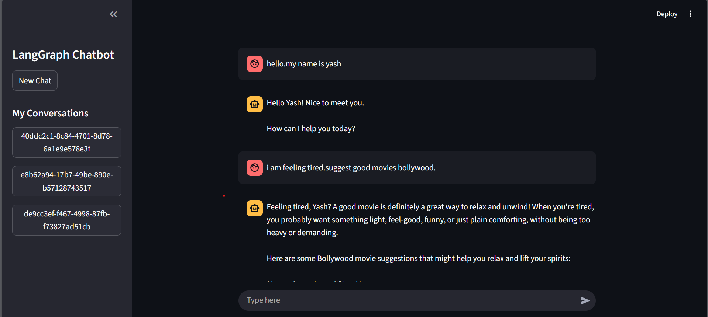

# Chatbot LangGraph

A conversational AI chatbot built with LangGraph and Streamlit, powered by Google's Gemini 2.5 Flash model.



## Features

- **LangGraph Integration**: Uses LangGraph for state management and conversation flow
- **Google Gemini AI**: Powered by Google's Gemini 2.5 Flash model for intelligent responses
- **Streamlit UI**: Clean and interactive web interface built with Streamlit
- **Conversation Memory**: Maintains conversation history across sessions
- **Real-time Streaming**: Responses are streamed in real-time for better user experience
- **Database Integration**: Sqlite database is integarted with backend

## Prerequisites

- Python 3.8+
- Google AI API key (Gemini)

## Installation

1. Clone this repository:

   ```bash
   git clone <repo-url>
   cd chatbot_langgraph
   ```

2. Create and activate a virtual environment:

   ```bash
   python -m venv venv
   source venv/bin/activate  # On Windows: venv\Scripts\activate
   ```

3. Install required dependencies:

   ```bash
   pip install langgraph langchain-google-genai streamlit python-dotenv
   ```

4. Set up your Google AI API key:
   - Get your API key from [Google AI Studio](https://makersuite.google.com/app/apikey)
   - Create a `.env` file in the project root and add:
     ```
     GOOGLE_API_KEY=your_api_key_here
     ```
   - Or the application will prompt you to enter it when first run

## Usage

Run the Streamlit application:

```bash
streamlit run langgraph_frontend.py
```

The application will:

1. Open in your default web browser
2. Prompt for your Google AI API key if not set in environment variables
3. Provide a chat interface where you can interact with the AI

## Notes

- The chatbot maintains conversation context using LangGraph's checkpointing system
- All conversations are stored in memory (not persisted to disk)
- The application uses thread-based conversation management
- Make sure you have sufficient API credits for Google Gemini
